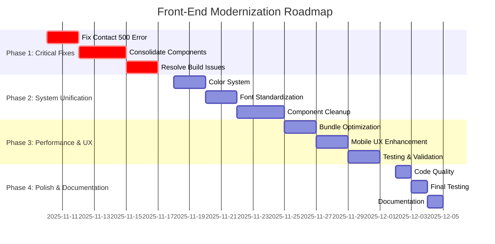
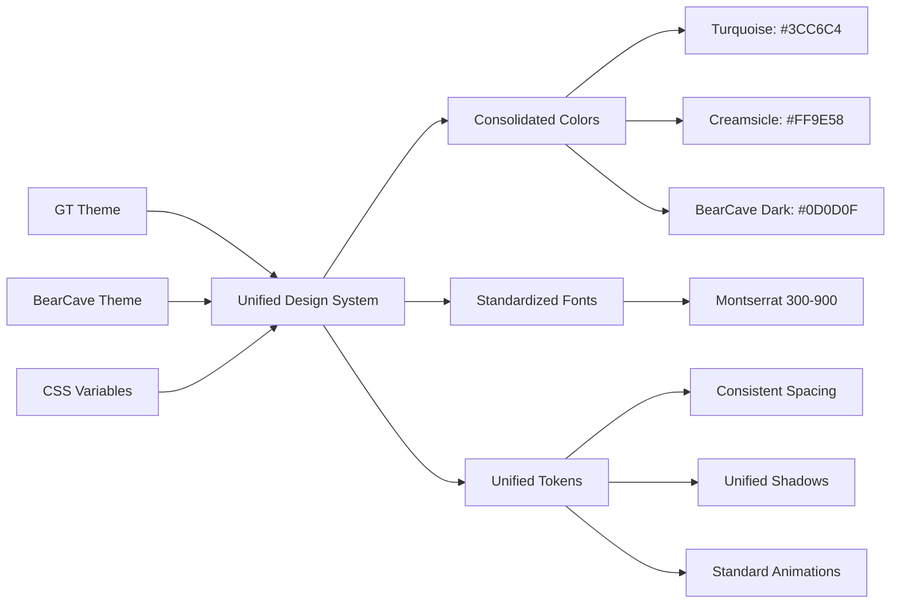

# Bear Cave Marketing Front-End Modernization Timeline

## Visual Timeline (4-Week Implementation)



## Component Consolidation Map

```mermaid
graph TD
    A[SectionWrapper Components] --> B[Consolidated SectionWrapper]
    A --> C[src/components/SectionWrapper.tsx]
    A --> D[src/components/ui/SectionWrapper.tsx]
    A --> E[src/sections/SectionWrapper.tsx]

    F[HeroSection Components] --> G[Unified HeroSection]
    F --> H[src/components/sections/gt/HeroSection.tsx]
    F --> I[src/components/case-study/HeroSection.tsx]
    F --> J[src/sections/HeroSection.tsx]

    K[Layout Components] --> L[Single Footer]
    K --> M[src/components/layout/Footer.tsx]
    K --> N[src/components/layout/BearCaveFooter.tsx]

    O[Page Components] --> P[Single Home Page]
    O --> Q[src/pages/GTHomePage.tsx]
    O --> R[src/pages/GTThemeHome.tsx]
```



## Design System Integration



## Performance Optimization Flow

```mermaid
flowchart TD
    A[Current Bundle Issues] --> B[Bundle Analysis]
    B --> C[Large Chunks >1000kB]
    B --> D[Duplicate Dependencies]

    C --> E[Optimize manualChunks]
    D --> F[Remove Redundant Imports]

    E --> G[Better Code Splitting]
    F --> H[Tree Shaking]

    G --> I[Performance Goals]
    H --> I

    I --> J[< 500kB per chunk]
    I --> K[< 2s initial load]
    I --> L[90+ Lighthouse score]