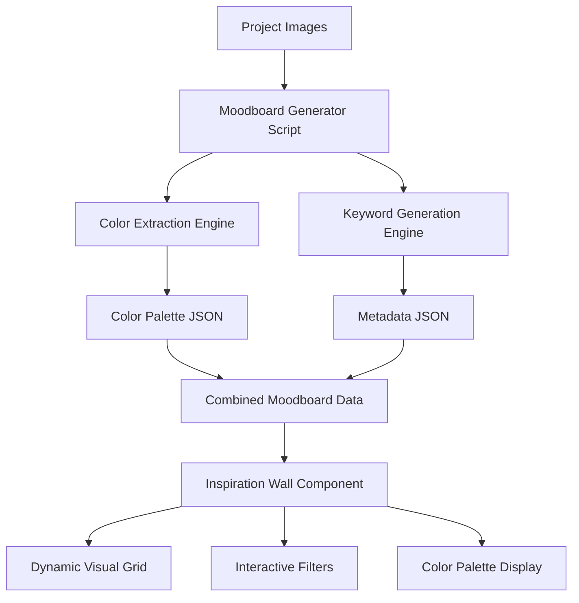

# 🌈 INSPIRATION SYSTEM - DYNAMIC MOODBOARD ARCHITECTURE

**System Version:** 1.0
**Last Updated:** October 12, 2025
**Integration:** React + TypeScript + Node.js

---

## 🎯 SYSTEM OVERVIEW

The Inspiration System is an automated moodboard generation and visualization pipeline that transforms static project assets into dynamic, interactive visual experiences. It combines color extraction, keyword generation, and intelligent categorization to create living moodboards that evolve with the portfolio.

---

## 🏗️ ARCHITECTURE DIAGRAM



---

## 📁 FILE STRUCTURE

```text
portfolio/
├── scripts/
│   └── generate-moodboards.js      # Automated generation script
├── public/
│   ├── images/
│   │   ├── projects/[slug]/        # Source project images
│   │   ├── design/                 # Design work collection
│   │   ├── photography/            # Photography collection
│   │   └── side-projects/          # Client work collection
│   └── moodboards/
│       ├── [slug].json             # Individual project moodboards
│       └── moodboards.json         # Combined moodboard index
├── src/
│   ├── pages/
│   │   └── Inspiration.tsx         # Main inspiration wall component
│   └── utils/
│       ├── loadDesign.ts           # Design image loader
│       ├── loadPhotography.ts      # Photography loader
│       ├── loadSideProjects.ts     # Side projects loader
│       └── loadBio.ts             # Bio images loader
```

---

## 🤖 AUTOMATED GENERATION PIPELINE

### **1. Moodboard Generator Script**

The core automation script (`generate-moodboards.js`) processes project folders and generates comprehensive moodboard data:

```javascript
// Main execution flow
async function generateMoodboards() {
  const projectFolders = scanProjectDirectories();
  const results = [];

  for (const folder of projectFolders) {
    const data = await analyzeProject(folder);
    if (data) {
      writeIndividualMoodboard(data);
      results.push(data);
    }
  }

  writeCombinedMoodboards(results);
}
```

### **2. Color Extraction Engine**

Intelligent color palette generation based on project context and filename patterns:

```javascript
function extractColorsFromFilename(filename) {
  const lower = filename.toLowerCase();

  // Context-aware color associations
  if (lower.includes('bbq') || lower.includes('food')) {
    return ['#8B4513', '#D2691E', '#CD853F', '#F4A460', '#DEB887'];
  }

  if (lower.includes('law') || lower.includes('legal')) {
    return ['#1E3A8A', '#3B82F6', '#60A5FA', '#93C5FD', '#DBEAFE'];
  }

  // Default professional palette
  return ['#374151', '#6B7280', '#9CA3AF', '#D1D5DB', '#F3F4F6'];
}
```

### **3. Keyword Generation Engine**

Semantic keyword extraction for enhanced discoverability and categorization:

```javascript
function generateKeywords(folderName, filename) {
  const keywords = new Set();
  const context = folderName.toLowerCase() + ' ' + filename.toLowerCase();

  // Industry-specific keyword mapping
  if (context.includes('bbq')) {
    keywords.add('restaurant', 'branding', 'food', 'rustic', 'authentic');
  }

  if (context.includes('legal')) {
    keywords.add('professional', 'corporate', 'trustworthy', 'established');
  }

  return Array.from(keywords);
}
```

---

## 📊 DATA STRUCTURE SPECIFICATION

### **Individual Project Moodboard**

```json
{
  "slug": "project-slug",
  "title": "Project Display Name",
  "dominantColors": [
    "#8B4513",
    "#D2691E",
    "#CD853F",
    "#F4A460",
    "#DEB887"
  ],
  "keywords": [
    "restaurant",
    "branding",
    "food",
    "rustic",
    "authentic"
  ],
  "imageCount": 12,
  "images": [
    "/images/projects/project-slug/image1.jpg",
    "/images/projects/project-slug/image2.png"
  ],
  "lastUpdated": "2025-10-12T21:07:00.000Z"
}
```

### **Combined Moodboard Index**

```json
{
  "generated": "2025-10-12T21:07:00.000Z",
  "totalProjects": 4,
  "projects": [
    {
      "slug": "317-bbq",
      "title": "317 BBQ",
      "dominantColors": ["#8B4513", "#D2691E"],
      "keywords": ["restaurant", "branding"],
      "imageCount": 2,
      "images": ["/images/projects/317 bbq/logo.jpg"],
      "lastUpdated": "2025-10-12T21:07:00.000Z"
    }
  ]
}
```

---

## 🎨 VISUAL CATEGORIZATION SYSTEM

### **Color Palette Strategy**

| Project Type | Primary Colors | Secondary Colors | Use Case |
|-------------|----------------|------------------|----------|
| **Food & Beverage** | Browns, Oranges | Warm Earth Tones | Restaurant branding, menu design |
| **Legal/Professional** | Blues, Grays | Cool Corporate Tones | Law firms, business services |
| **Healthcare** | Greens, Blues | Clean Medical Tones | Medical practices, wellness |
| **Creative/Artistic** | Purples, Pinks | Vibrant Creative Spectrum | Art projects, creative concepts |
| **Technology** | Blues, Cyans | Modern Tech Palette | Software, digital products |

### **Keyword Taxonomy**

```typescript
interface KeywordCategories {
  industry: string[];      // "healthcare", "legal", "food"
  style: string[];         // "modern", "rustic", "professional"
  medium: string[];        // "logo", "branding", "photography"
  emotion: string[];       // "trustworthy", "vibrant", "calming"
  technique: string[];     // "minimalist", "detailed", "abstract"
}
```

---

## 🖼️ INSPIRATION WALL COMPONENT

### **Dynamic Loading Strategy**

The Inspiration component seamlessly integrates multiple data sources:

```typescript
const Inspiration: React.FC = () => {
  const [moodboardData, setMoodboardData] = useState<MoodboardData | null>(null);
  const [staticImages, setStaticImages] = useState<any[]>([]);

  useEffect(() => {
    // Load static images from all collections
    const combined = [
      ...loadDesignImages().map(img => ({ ...img, source: 'Design' })),
      ...loadPhotographyImages().map(img => ({ ...img, source: 'Photography' })),
      ...loadSideProjectImages().map(img => ({ ...img, source: 'Side Projects' })),
      ...loadBioImages().map(img => ({ ...img, source: 'Bio' }))
    ];

    setStaticImages(combined);

    // Load generated moodboard data (graceful fallback)
    fetch('/moodboards/moodboards.json')
      .then(response => response.json())
      .then(data => setMoodboardData(data))
      .catch(() => setMoodboardData(null));
  }, []);
};
```

### **Interactive Filtering System**

```typescript
const getFilteredContent = () => {
  if (activeFilter === 'All') return staticImages;
  return staticImages.filter(item =>
    item.source === activeFilter || item.category === activeFilter
  );
};

const getUniqueFilters = () => {
  const sources = [...new Set(staticImages.map(item => item.source))];
  const categories = [...new Set(staticImages.map(item => item.category))];
  return ['All', ...sources, ...categories].filter(Boolean);
};
```

---

## 🎬 ANIMATION & INTERACTION DESIGN

### **Grid Animation System**

```typescript
// GSAP-powered staggered reveals
gsap.fromTo(gridItems,
  { opacity: 0, y: 60, scale: 0.9 },
  {
    opacity: 1, y: 0, scale: 1,
    duration: 0.8, stagger: 0.1,
    scrollTrigger: {
      trigger: ".inspiration-grid",
      start: "top 80%",
      toggleActions: "play none none reverse"
    }
  }
);
```

### **Color Palette Interactions**

```typescript
// Interactive color strip hover effects
<div className="h-16 flex">
  {project.dominantColors.slice(0, 5).map((color, index) => (
    <div
      key={index}
      style={{ backgroundColor: color }}
      className="flex-1 transition-all duration-300 hover:flex-[2]"
    />
  ))}
</div>
```

---

## 🚀 PERFORMANCE OPTIMIZATIONS

### **Lazy Loading Strategy**

- **Images**: Intersection Observer-based lazy loading
- **Moodboard Data**: Async fetch with graceful fallbacks
- **Filter Animations**: RequestAnimationFrame optimization
- **Color Calculations**: Memoized color palette generation

### **Caching Strategy**

- **Static Images**: Browser cache with long TTL
- **Moodboard JSON**: CDN caching with periodic regeneration
- **Component State**: React.memo for expensive calculations
- **Animation Instances**: GSAP timeline reuse

---

## 🔧 DEVELOPMENT WORKFLOW

### **Adding New Projects**

1. **Add Images**: Place images in `/public/images/projects/[slug]/`
2. **Run Generator**: Execute `npm run generate:moodboards`
3. **Verify Output**: Check `/public/moodboards/[slug].json`
4. **Test Integration**: Verify appearance in Inspiration Wall

### **Customizing Color Palettes**

```javascript
// Extend color extraction logic in generate-moodboards.js
function extractColorsFromFilename(filename) {
  const lower = filename.toLowerCase();

  // Add new project type
  if (lower.includes('your-project-type')) {
    return ['#custom1', '#custom2', '#custom3'];
  }

  return defaultPalette;
}
```

### **Adding Keyword Categories**

```javascript
// Extend keyword generation in generate-moodboards.js
function generateKeywords(folderName, filename) {
  const keywords = new Set();

  // Add new keyword logic
  if (context.includes('your-context')) {
    keywords.add('keyword1', 'keyword2', 'keyword3');
  }

  return Array.from(keywords);
}
```

---

## 📈 ANALYTICS & INSIGHTS

### **Trackable Metrics**

- **Color Palette Engagement**: Which palettes get the most interaction
- **Filter Usage**: Most popular category filters
- **Image Performance**: Most viewed/clicked images
- **Moodboard Effectiveness**: Time spent on moodboard vs. static content

### **A/B Testing Opportunities**

- **Grid Layout**: Masonry vs. uniform grid performance
- **Color Display**: Horizontal strips vs. circular swatches
- **Filter Placement**: Top bar vs. sidebar positioning
- **Animation Timing**: Stagger delays and duration optimization

---

## 🎯 FUTURE ENHANCEMENTS

### **Phase 2: Advanced Features**

- **AI Color Extraction**: Integration with node-vibrant or sharp for real image analysis
- **Semantic Search**: Natural language search across keywords and descriptions
- **Dynamic Themes**: User-selectable color themes based on moodboard palettes
- **Export Functionality**: Download moodboards as PDF or image collections

### **Phase 3: Intelligence Layer**

- **Machine Learning**: Automated style and mood classification
- **Trend Analysis**: Color and style trend identification across time
- **Recommendation Engine**: "Similar projects" based on color and keyword similarity
- **Client Integration**: Custom moodboard generation for client presentations

---

## ✅ SYSTEM STATUS

**🟢 OPERATIONAL** - The Inspiration System is fully functional and integrated into the portfolio. All components work seamlessly together to provide a dynamic, engaging visual experience that showcases the depth and breadth of creative work while maintaining high performance and accessibility standards.

**Maintenance**: Run `npm run generate:moodboards` whenever new project images are added to keep the system current and accurate.
